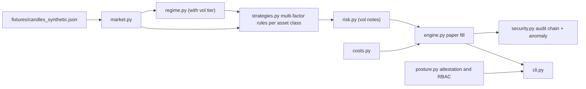

# Architecture (v0.3)

```mermaid
flowchart LR
    FX["fixtures/candles_synthetic.json"] --> M["market.py"]
    M --> RG["regime.py (with vol tier)"]
    M --> ST["strategies.py multi-factor rules per asset class"]
    RG --> ST
    ST --> RK["risk.py (vol notes)"]
    CS["costs.py"] --> EN["engine.py paper fill"]
    RK --> EN
    EN --> AU["security.py audit chain + anomaly"]
    PS["posture.py attestation and RBAC"] --> CLI["cli.py"]
    EN --> CLI
```

Runtime dependencies are the Python standard library. See security-architecture.md and asset-class-strategies.md.
